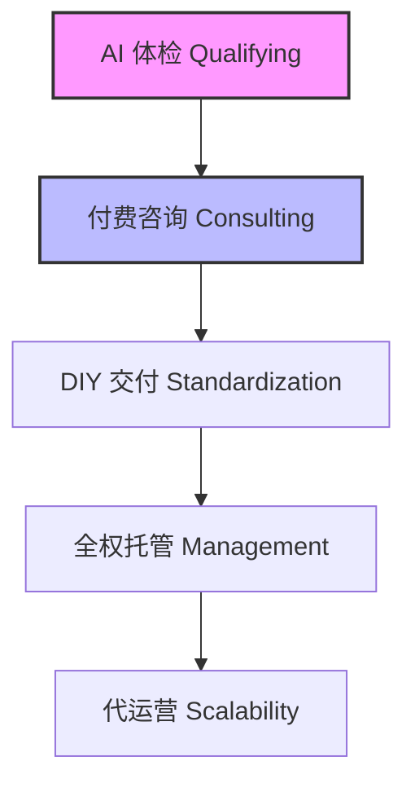

# 弘业坊 (Hongyefang) 核心业务逻辑架构

## 一、 核心痛点：从“体力筛选”到“算法准入”
传统创业咨询的效率瓶颈在于**咨询师的时间稀缺性**与**用户需求的离散性**之间的矛盾：

1.  **资源错配**：大量无效咨询（如零资金储备、零时间投入的“幻觉型”用户）占据了核心产能。
2.  **筛选成本**：依赖人工初步沟通导致转化路径过长，缺乏标准化的准入画像（ICP）。

### 💡 弘业坊解法：AI 驱动的 5 级服务漏斗

---

## 二、 核心业务逻辑流

### 1. 结构化数据采集 (Chat-to-Data)
利用 **AI 对话交互** 替代枯燥的表单，实时采集并使用 **Zod** 校验关键经营参数：

| 维度符号 | 维度名称 | 定义描述 | 单位 |
| :--- | :--- | :--- | :--- |
| **$C$** | **Capital** | 年度弹性资金 | 万元 |
| **$T$** | **Time** | 每周可投入时间 | 小时 |
| **$R$** | **ROI** | 预期年化回报 | % |
| **$I$** | **Initial** | 初期投入金额 | 万元 |

### 2. 混合动力评估引擎 (Hybrid Engine)
采用 **“规则硬性评分 + LLM 感性叙述”** 的双轨机制，确保评估的严谨性与温度。

#### 确定性评分 (Rule-based)
基于加权算法计算综合适配分：
$$Score = C \times 40\% + I \times 30\% + T \times 20\% + R \times 10\%$$

> [!CAUTION]
> **风控熔断机制 (Circuit Breaker)**
> 针对“许愿型”用户（如 $R > 500\%$），系统执行 **一键熔断**。
> 自动标记为“高风险/需准备”，强制降低适配等级，从源头过滤非理性诉求。

#### 非对称 AI 生成
调用 **DeepSeek** 对得分点进行深度解读。即使 API 波动，也内置了**降级文案池**，保障服务的高可用性。

---

## 三、 差异化转化策略 (Tiered CTA)
系统根据评分等级，动态匹配最合适的后续服务路径：

| 等级名称 | 分值区间 | 核心策略 | 引导产品路径 |
| :--- | :--- | :--- | :--- |
| **精英组** | $\ge 700$ | 聚焦**效率提升** | 引导至 **旗舰版咨询** |
| **潜力组** | $400 - 699$ | 聚焦**规避风险** | 引导至 **专业版咨询** |
| **孵化组** | $< 400$ | 聚焦**认知补齐** | 引导至 **标准版 / DIY 资料** |
