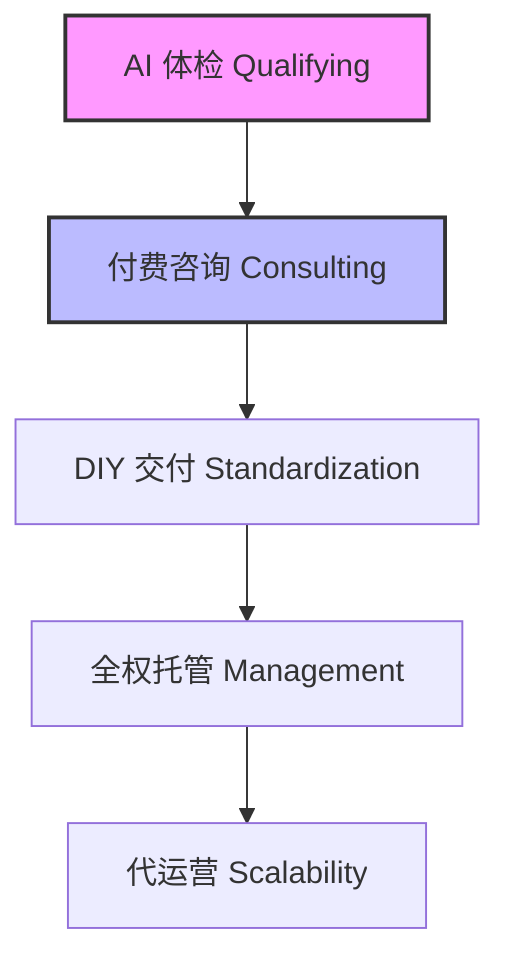

# 弘业坊 (hongyefang)

**AI 驱动的创业咨询筛选漏斗** — 用 AI 精准识别优质创业者，让有价值的咨询高效匹配，而不是被无效沟通淹没。

## 为什么做这个

创业咨询行业有一个根本矛盾：**咨询师的时间稀缺性**与**用户需求的离散性**之间的矛盾。大量无效咨询（如“幻觉型”用户）占据了核心产能，导致筛选成本过高。

弘业坊通过 **AI 驱动的 5 级服务漏斗** 实现“从体力筛选到算法准入”：

1.  **AI 体检 (Qualifying)**：AI 对话收集画像，实时评估。
2.  **付费咨询 (Consulting)**：精准匹配优质用户。
3.  **DIY 交付 (Standardization)**：标准资料包。
4.  **全权托管 (Management)**：深度介入。
5.  **代运营 (Scalability)**：规模化扩张。

**核心逻辑详见：[CORE_LOGIC.md](./CORE_LOGIC.md)**

## 服务漏斗



## 技术栈

| 层 | 技术 |
|---|------|
| 框架 | Next.js 16 (App Router) |
| 语言 | TypeScript |
| 样式 | Tailwind CSS 4 |
| 后端 | Supabase (PostgreSQL + Auth + RLS) |
| AI | DeepSeek (via Vercel AI SDK) |
| 验证 | Zod |
| 测试 | Vitest |

## 项目结构

```
src/
├── app/
│   ├── (chat)/
│   │   ├── assessment/    # AI 创业体检对话
│   │   ├── result/        # 评估结果页
│   │   ├── consult/       # 咨询套餐定价页
│   │   └── payment-success/ # 支付成功确认页
│   ├── (auth)/
│   │   ├── login/         # 登录
│   │   ├── reset-password/
│   │   ├── update-password/
│   │   └── callback/      # Supabase auth 回调
│   └── dashboard/         # 用户首页
├── components/
│   ├── ui/                # 通用组件 (Button 等)
│   ├── chat/              # 对话组件
│   ├── result/            # 评估结果组件
│   └── consult/           # 咨询套餐组件
├── lib/
│   ├── supabase/          # Supabase 客户端
│   ├── assessment/        # 评估逻辑引擎
│   └── orders/            # 订单 Server Actions
└── types/                 # TypeScript 类型
```

## 快速开始

### 前置条件

- Node.js 18+
- Supabase 项目（本地或远程）

### 环境变量

```bash
cp .env.local.example .env.local
```

编辑 `.env.local`：

```env
NEXT_PUBLIC_SUPABASE_URL=https://<your-project>.supabase.co
NEXT_PUBLIC_SUPABASE_ANON_KEY=<your-anon-key>
DEEPSEEK_API_KEY=<your-deepseek-api-key>
```

### 安装运行

```bash
pnpm install
pnpm dev
```

### 推送数据库迁移

```bash
npx supabase link --project-ref <your-project-ref>
npx supabase db push
```

## 当前进度

| Phase | 内容 | 状态 |
|-------|------|------|
| 1 | 基础搭建 + 用户认证（邮箱/手机注册登录） | ✅ 完成 |
| 2 | AI 创业体检对话系统 | 待开始 |
| 3 | 评估引擎 — 画像生成 + 结果展示 | 待开始 |
| 4 | 付费转化 — 咨询展示 + 支付集成 | ✅ 完成 |

## License

Private — all rights reserved.
